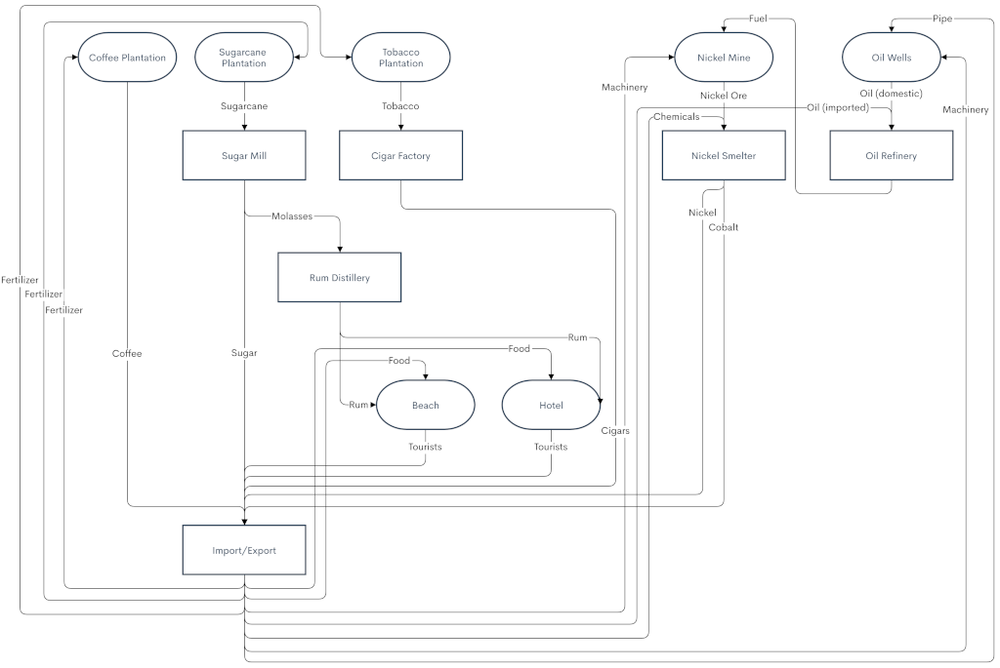

# Industries of the Caribbean

([Read in Simplified Chinese](README-CN.md))

Industries of the Caribbean models a state-run economy where you own the industries and production chain, in addition to the transport network. The economy is export-driven: unless you export a cargo, you don’t get paid for transporting it.

Your island has fertile soil and rich deposits of oil and nickel, but no processing industries to produce valuable products.

(Jump to [Design Philosophy](#design-philosophy))

## Production flowchart

#### Trade deals at Import/Export
* Coffee -> Food
* Sugar -> Oil
* Nickel -> Fertilizer
* Cobalt -> Pipe
* Cigars -> Chemicals
* Tourists -> Machinery

## Cargo types
Unlike in most OpenTTD economies, cargo payments do not depend on the distance transported. This models the player controlling a state-run import/export economy rather than simply a transport company.

#### Exported cargos
These are exported to the Import/Export industry where they are traded for other cargos. These make significant profit.

#### Imported cargos
These are obtained in exchange for exported cargos at the Import/Export industry. They cost you money to transport, so don't import more than you need!

#### Domestic cargos
These are all other cargos, including Workers and intermediate cargos which travel between industries. They make a slight loss. The one exception is Mail, which makes a normal profit.

## General industry mechanics
Industries do not close or change production.

#### Primary industries
* Coffee Plantation
* Sugarcane Plantation
* Tobacco Plantation
* Oil Wells
* Nickel Mine

These industries generate naturally, sometimes with with elevation or distance from town requirements. Many require a cargo to be delivered for their production like Pipe for Oil Wells and Food for Hotels. Also delivering a boost cargo will double production. Boost cargos are stockpiled and consumed during each production tick (8-9 times per month) to determine how much cargo is produced.

#### Secondary industries
* Oil Refinery
* Sawmill
* Furniture Factory
* Paper Mill
* Box Factory
* Bakery

These industries are funded by the player. They require one Worker for each unit of input cargo. If this seems like a lot, it is! Workers are the main production bottleneck and you'll need to both connect many towns to each industry, and deliver the necessary cargos to grow these towns.

Also, some of these industries have additional cargos, like Chemicals for the Nickel Smelter, which are required input cargos. The industry window lists the ratio of input cargo required for each unit of output cargo.

## Getting started

Initially, the only profitable cargo is coffee, which requires no processing before it is exported.

Start by exporting as much coffee as you can until you can afford your first processing industry: the sugar mill. After that, unlock new cargo chains by funding the proper industries, as governed by the cargo flowchart and the Import/Export trade deals.

Be careful, though, not to expand into a cargo chain before you have the required cargos — for example, the Nickel chain requires Chemicals, which are obtained by exporting Cigars.

Remember that imported cargos cost you money to transport — check the Cargo Payment Rates graph if you're unclear.

#### Recommended Settings

* News/Advisors: Warn if a vehicle’s income is negative: Off
* News/Advisors: Warn if a vehicle is lost: Off
* Environment > Industries > Company stations can serve industries with attached neutral stations: Off
* Environment > Cargo distribution: Manual

#### Recommended World Generation settings

* Climate: Sub-tropical
* Sea level: Medium
* No. of towns: High
* No. of industries: Low
* Desert coverage: 0%

#### Required NewGRFs

* Improved Town Layouts 1.4.0 or later
  * (These houses don’t accept Workers or Food, keeping those cargos going only to your industries.)

#### (Optional) Suggested NewGRFs
My personal favorites, if you don't have your own.
* Iron Horse 2
* Termite (tracks)
* SHARK (ships)
* Mop Expanded Road Vehicles
* Unspooled (roads)
* Av9.8 Aircraft Set
* OpenGFX+ Airports
* Industrial Stations Renewal
* ISR-style Dock
* ISR/DWE-style Objects
* US Stations set
* Total Bridge Renewal Set
* Rainforest Ruins

## Credits
* Beach sprites: [Beach Objects](https://www.tt-forums.net/viewtopic.php?f=26&t=62258) by Quast65, GPL v3 license

## Translations
* English
* Simplified Chinese (chengdd1987)
* French (arikover)

To add a translation, please create a Pull Request!

## Design philosophy

Industries of the Caribbean is an experimental industry/economy mod which aims to radically rethink the OpenTTD economy by breaking common design patterns and reclaiming “useless” features to add interesting gameplay.

Before we get into what I’ve changed, let’s briefly recap how vanilla and most NewGRF economies are structured:

* Money is an early-game constraint, but by mid-game your company earns money faster than you can spend it. The constraint then becomes tile space for stations, junctions, and mainline throughput. OpenTTD would still be fun without money.
* Industries grow to immense production either through station rating-fueled production increases (vanilla), or boost cargos (FIRS). This high production usually requires double-track infrastructure, and don’t even dream of using road vehicles for cargo.
* Most production chains lead to town cargos which are delivered to “black hole” industries, such as Goods, Alcohol, or Vehicles. These are highly profitable, but by the time you complete the production chain to this extent, money is generally not a motivating factor.

The serious OpenTTD players I talk to tend to fall into two gameplay categories:

1. Players who build passenger networks using CargoDist to route passengers automatically and create network design and capacity challenges for gameplay interest.
2. Players who build cargo networks using a complex industry mod like FIRS Steeltown or XIS.

I have played both styles of game and have been frustrated and intrigued by features in each which fall short of interesting gameplay:

* Road vehicles are too low capacity to be useful outside niche roles like boost cargo distribution, feeder lines, or very short distance routes.
* Without daylength patches such as in JGRPP, most rail lines require double track. It would be nice to have some low-traffic branch lines in addition to the heavy trunk lines.
* Ships are so slow that unless you absolutely need them to reach Oil Rigs (vanilla) or Fishing Grounds (FIRS), using them instead of trains often feels silly.
* Passenger transportation gives you nothing but money (a “bad feature,” remember?) and its only gameplay interest comes from fighting to keep up with CargoDist and town growth...which is often more frustrating than fun.
* Endgame town cargos have no incentive to deliver them, and it’s just as profitable to dump them all in one place rather than distributing them across the map.
* Cargo aging and different values per cargo only matter in the early game.
* If you’re not playing with passengers or mail, towns are useless to you and just get in the way.

So, what ~~weird and ill-advised~~ interesting things can we do to change this?

* Primary industries have a fixed production much lower than FIRS, to encourage road vehicles and single-track rail lines to industries while still keeping enough production for busy trunk lines.
* Only primary industries spawn on map generation, and all secondary industries are funded by the player — more on this later. Industries never change production or close, and only Hotels spawn during the game.
* Secondary industries need an immense supply of Workers: one per unit of cargo converted. Funding them requires you to think about worker supply and once built, you’ll need to grow cities and run commuter trains from nearby towns and cities.
